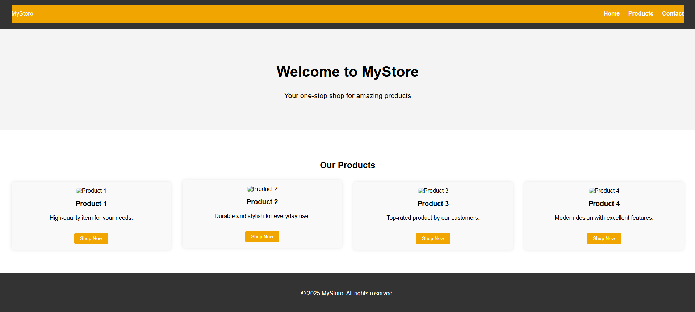
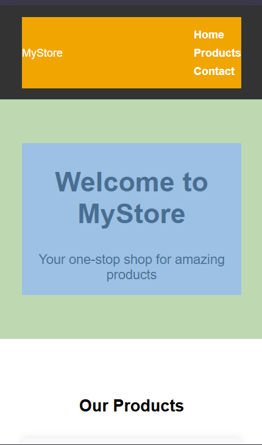

# Online Store Landing Page

This HTML code provides the basic structure for a landing page for an online store named "MyStore". It includes a header with navigation links, a hero section to welcome visitors, a product section showcasing several products, and a footer with copyright information.

## Provisions for Adding Images

The current HTML structure already includes `` tags within each product card. To add your own product images, you will need to replace the placeholder image URLs (`https://via.placeholder.com/150`) in the `src` attribute of these `` tags with the actual paths or URLs of your image files.

For example, if you have an image named `product1.jpg` in the same directory as your HTML file, you would modify the first product card like this:

